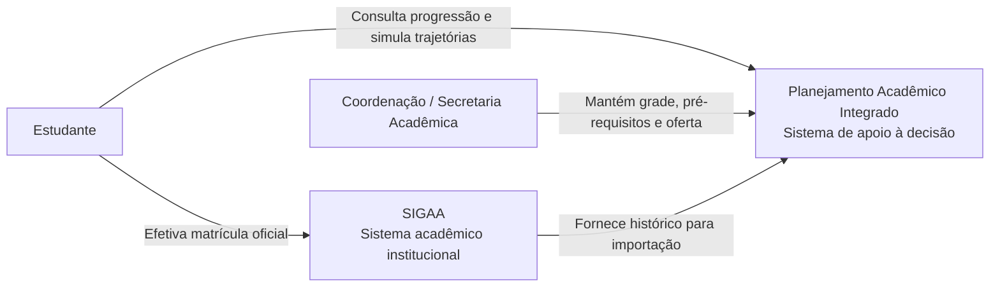
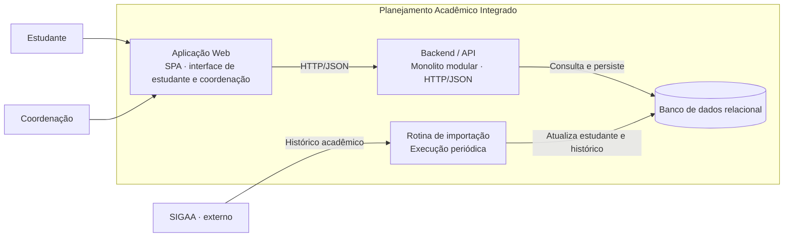
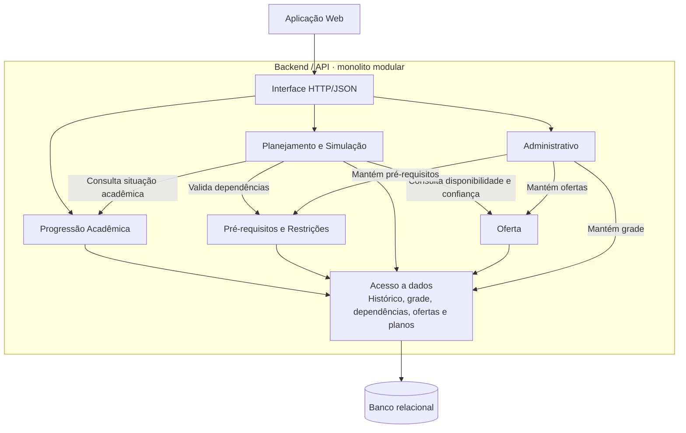

# Proposta de Arquitetura de Sistemas de Informação

**Planejamento Acadêmico Integrado · IESI**  
**Prof. Paulemir Gonçalves Campos**

Este registro foi organizado a partir da proposta fornecida pelo autor do projeto. As figuras originais não foram anexadas; os diagramas Mermaid abaixo representam a descrição textual e podem ser refinados quando as figuras forem disponibilizadas. As Seções 1–8 registram a proposta completa; a Seção 9 identifica as escolhas aprovadas e o estágio da implementação.

## 1. Introdução

O sistema apoia a visualização da progressão, a simulação de matrícula e o planejamento até a conclusão do curso, sem substituir o SIGAA. A proposta parte dos problemas levantados na Entrega 1 e dos processos AS-IS e TO-BE e necessidades tratados na Entrega 2. Esses documentos anteriores ainda não estão neste repositório.

A arquitetura se organiza nos domínios de Negócios, Dados, Aplicações e Tecnologia e utiliza três níveis do C4 Model: contexto, containers e componentes.

## 2. Visão geral e contexto — C4 nível 1

A escolha é um **monolito modular**: uma aplicação de backend, um banco de dados e um processo de implantação, com separação interna por responsabilidade.

## 3. Arquitetura de Negócios

| Ator | Responsabilidade |
| --- | --- |
| Estudante | Consulta sua situação acadêmica, simula cenários e planeja sua trajetória. |
| Coordenação / Secretaria Acadêmica | Mantém grade curricular, pré-requisitos e oferta atualizados. |
| SIGAA | Fornece o histórico e mantém o registro oficial de matrícula. |

O processo suportado antecede a matrícula: consolidar a situação acadêmica, simular combinações, receber validação de pré-requisitos e seguir manualmente para o SIGAA. A arquitetura reaproveita o domínio de negócios das entregas anteriores, sem propor mudanças em seus atores ou processo.

As dez funções das entregas anteriores continuam sendo o escopo. O agrupamento conhecido é registrado na Seção 5; a descrição individual de F1–F10 depende dos documentos originais.

## 4. Arquitetura de Dados

### 4.1 Entidades e origem

| Entidade | Descrição | Origem |
| --- | --- | --- |
| Estudante | Identificação e vínculo com o curso. | SIGAA, por importação. |
| Histórico Acadêmico | Disciplinas cursadas, aproveitamento e situação. | SIGAA, por importação. |
| Disciplina | Componente curricular do curso. | Coordenação. |
| Pré-requisito | Dependência entre duas disciplinas. | Coordenação. |
| Oferta | Disponibilidade por período letivo, confirmada ou prevista. | Coordenação. |
| Plano / Simulação | Combinação de disciplinas para um ou mais períodos. | Gerado no sistema a partir do planejamento do estudante. |

### 4.2 Fluxo dos dados

O SIGAA é a fonte de verdade do histórico acadêmico. A coordenação mantém os dados curriculares e a oferta, atendendo à necessidade N7 de manutenção centralizada descrita na proposta. Planos e simulações são armazenados pelo sistema e não são enviados ao SIGAA.

### 4.3 Qualidade e limites

Uma oferta futura deve indicar se é **confirmada** ou **prevista**. A previsão de conclusão deve sinalizar quando depender de oferta ainda não confirmada. O formato de importação, a frequência de atualização e o esquema físico do banco permanecem a definir.

## 5. Arquitetura de Aplicações

| Módulo | Funções cobertas | Responsabilidade |
| --- | --- | --- |
| Progressão Acadêmica | F1 | Consolida disciplinas concluídas, em andamento e pendentes. |
| Pré-requisitos e Restrições | F2, F7 | Mapeia dependências e valida os planos. |
| Planejamento e Simulação | F3, F4, F5, F6, F9, F10 | Simula cenários, recalcula conclusão, identifica disciplinas críticas, recomenda e compara trajetórias. |
| Oferta | F8 | Mantém a oferta confirmada e prevista por período letivo. |
| Administrativo | Sem função numerada na proposta | Oferece operações para manutenção da grade, pré-requisitos e oferta pela coordenação. |

### 5.1 Containers — C4 nível 2

Os containers representam responsabilidades técnicas, sem implicar implantação de microsserviços. A rotina de importação pertence à solução; sua execução concreta ainda será definida.

### 5.2 Componentes do backend — C4 nível 3

O Planejamento consulta os módulos de Pré-requisitos e Oferta para reutilizar suas regras. As relações abaixo expressam colaboração lógica, sem definir endpoints ou contratos de código.

## 6. Arquitetura Tecnológica

| Camada | Escolha proposta | Critério |
| --- | --- | --- |
| Aplicação Web | Framework moderno, SPA. | Simulação interativa sem recarregar a página. |
| Backend / API | Monolito modular, HTTP/JSON. | Um serviço para manter e implantar, com responsabilidades internas separadas. |
| Banco de Dados | Relacional. | Relações fortes e necessidade de consistência. |
| Hospedagem | PaaS gerenciado. | Custo operacional baixo e dispensa administração de infraestrutura própria. |
| Integração SIGAA | Importação periódica, por job agendado. | Histórico não exige atualização a cada minuto; disponibilidade de API não está assegurada. |

O documento original não especificava frameworks, linguagem ou produto de banco. As escolhas posteriores estão na Seção 9; o provedor permanece a definir. A integração depende de um meio de acesso autorizado ao histórico; a existência de uma API do SIGAA não é presumida.

## 7. Justificativa

### 7.1 Monolito modular

O porte de um curso, a equipe pequena e a evolução conjunta dos módulos não justificam a complexidade operacional de microsserviços. Uma aplicação e um banco reduzem a manutenção e o esforço de entrega. Limites internos bem definidos permitem considerar a extração de um módulo no futuro, caso a escala realmente exija.

### 7.2 Limite de atuação perante o SIGAA

O sistema integra dados para apoiar decisões. Replicar matrícula institucional, carga docente, salas, calendários e políticas de toda a universidade está fora do escopo. O estudante continua realizando a matrícula no SIGAA.

### 7.3 Banco relacional

Disciplinas, dependências e ofertas por período têm relações explícitas. A consistência dessas relações é necessária para impedir recomendações incompatíveis com as regras curriculares.

### 7.4 Critérios de decisão

| Critério | Efeito na escolha |
| --- | --- |
| Custo | Monolito e hospedagem gerenciada reduzem operação. |
| Complexidade da equipe | Equipe pequena evita coordenação de serviços distribuídos. |
| Prazo | Uma aplicação reduz o esforço inicial de entrega. |
| Escala necessária | O público de um curso não exige escala independente dos módulos hoje. |

## 8. Conclusão

A proposta traduz o escopo funcional em um monolito com módulos por responsabilidade, dados centralizados com origens distintas e integração limitada ao histórico do SIGAA. Prioriza simplicidade operacional e permite evolução futura para outros cursos ou instituições, se necessária.

## 9. Decisões técnicas da primeira implementação

Stack aprovada: **Python + FastAPI**, **React + TypeScript + Vite + Tailwind CSS** e **PostgreSQL**. React Router organiza a navegação entre mapa e plano; TanStack Query gerencia os dados da API; Pydantic valida contratos; SQLAlchemy e Psycopg acessam o banco; Alembic versiona o esquema. pytest, Playwright e Ruff apoiam a verificação.

Frontend e backend ficam no mesmo repositório. A API permanece um serviço único, com módulos internos para grade curricular, pré-requisitos, progressão e planejamento. O módulo de grade oferece a leitura dos dados necessários ao primeiro fluxo e será usado pela futura administração. Oferta e Administrativo ainda não possuem fluxos implementados.

O fluxo atual é **login → histórico importado pela coordenação → progressão oficial → alternativa hipotética → salvamento → recuperação após novo acesso**. O módulo `personal` separa usuários, estudantes, sessões, versões de importações, registros acadêmicos e planos. A sessão determina o proprietário; o servidor deriva conclusões oficiais do histórico. Aprovações hipotéticas liberam dependentes somente no cenário. Desfazer uma hipótese remove escolhas dependentes sem alterar aprovações oficiais.

As 56 disciplinas e os quatro cenários vieram do protótipo como dados demonstrativos; não constituem validação da matriz oficial. Os cenários são arquivos locais do backend, enquanto disciplinas e pré-requisitos são carregados no banco por seed explícito. A demonstração antiga só é exposta com `DEMO_ENABLED` e `VITE_DEMO_ENABLED`; a interface pessoal começa no histórico oficial e não implementa regras de elegibilidade.

O Compose fornece somente o PostgreSQL de desenvolvimento. API e frontend são executados separadamente durante o desenvolvimento. Isso não representa definição da topologia de produção; hospedagem e implantação conjunta continuam pendentes.

Sessões opacas de oito horas usam identificadores aleatórios cujo hash é armazenado no PostgreSQL; senhas usam Argon2. Contas são provisionadas por CLI. Importações JSON completas são transacionais, versionadas e idempotentes. As alternativas são preservadas e reavaliadas após importação; o salvamento exige versão do plano e revisão do histórico. Bloqueios de linha por estudante serializam importações e gravações concorrentes.

Gestão de oferta, administração completa, integração automática com SIGAA, trajetórias de vários semestres e previsão ficam para etapas posteriores. A previsão heurística do HTML original não foi portada. Os diagramas anteriores representam a proposta futura; esta entrega não implementa o job periódico nem a interface administrativa.
